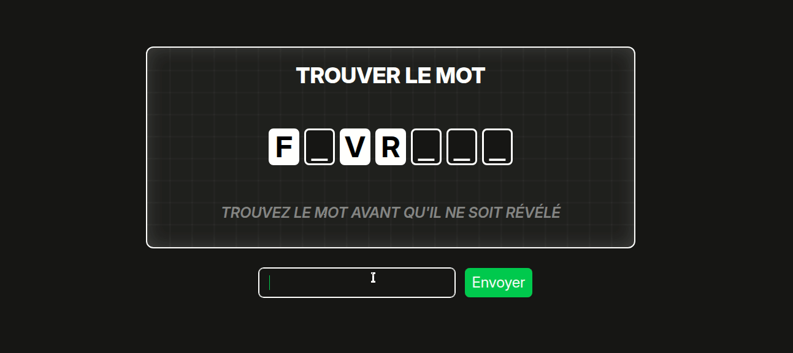

# Word Reveal

A fullstack word-guessing game. A random word is hidden and revealed letter by letter every 10 seconds — guess it before it's fully exposed.

**[Play it live →](https://word-reveal.vercel.app)**


<!-- Replace with an actual GIF or screenshot -->

---

## How it works

- A random word is selected and all letters are hidden except one
- Every 10 seconds, a random hidden letter is revealed
- Type your guess and submit before the last letter drops
- Win/loss stats are saved to your profile if you're logged in

---

## Tech stack

**Frontend**
- React 19 + Vite
- Tailwind CSS v4
- React Router v6
- canvas-confetti
- Deployed on **Vercel**

**Backend**
- Node.js + Express (ES Modules)
- Prisma v7 + PostgreSQL
- JWT authentication
- bcrypt password hashing
- Zod input validation
- Helmet for HTTP security headers
- Deployed on **Render**

**Database**
- PostgreSQL on **Supabase**

---

## Features

- **Authentication** — register, login, logout with JWT
- **Protected routes** — profile page redirects to login if unauthenticated
- **User stats** — games played, words found, win rate tracked per user
- **Leaderboard** — public ranking sorted by words found
- **Cold start handling** — silent ping on app load to wake the Render free tier

---

## Project structure

```
word-reveal/
├── frontend/               # React app
│   └── src/
│       ├── components/     # Game UI components
│       ├── context/        # AuthContext, GameContext
│       ├── hooks/          # useAuth, useGame
│       ├── pages/          # Home, Login, Register, Profile, Leaderboard
│       └── utils/          # Game logic, constants
└── backend/                # Express API
    ├── controllers/        # auth, user
    ├── routes/             # auth, user
    ├── middleware/         # JWT auth middleware
    ├── lib/                # Prisma client singleton, Zod schemas
    └── prisma/             # Schema, migrations
```

---

## API endpoints

| Method | Endpoint | Auth | Description |
|--------|----------|------|-------------|
| POST | `/api/auth/signup` | — | Register a new user |
| POST | `/api/auth/login` | — | Login, returns JWT |
| GET | `/api/user/profile` | ✓ | Get current user profile |
| PATCH | `/api/user/stats` | ✓ | Update game stats |
| GET | `/api/user/leaderboard` | — | Get all users ranked by wins |

---

## Local setup

**Prerequisites:** Node.js, PostgreSQL

```bash
# Clone the repo
git clone https://github.com/maudiffr/word-reveal.git
cd word-reveal
```

**Backend**
```bash
cd backend
npm install
cp .env.example .env   # fill in DATABASE_URL, JWT_SECRET
npx prisma migrate dev
npm run dev
```

**Frontend**
```bash
cd frontend
npm install
cp .env.example .env   # set VITE_API_URL=http://localhost:3000
npm run dev
```

---

## Background

This project was built to learn fullstack web development coming from a C/C++ background (42 School). The goal was to go from zero to a deployed fullstack app: covering REST API design, authentication, database modeling, and React state management.
